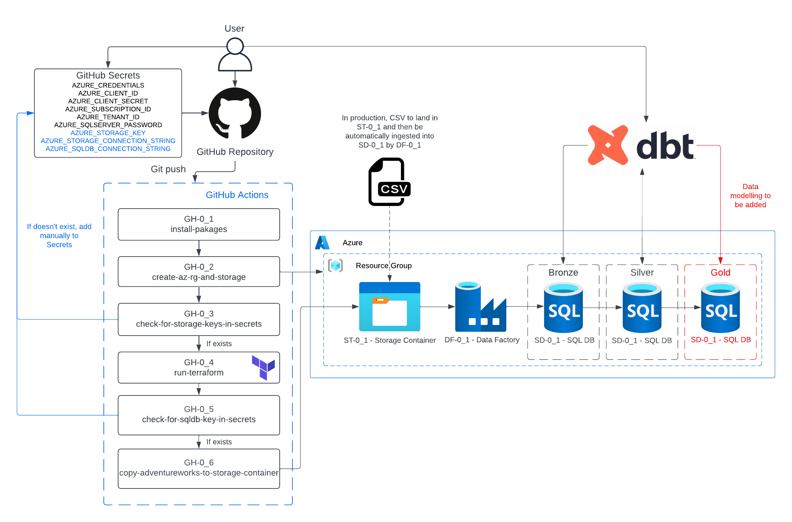
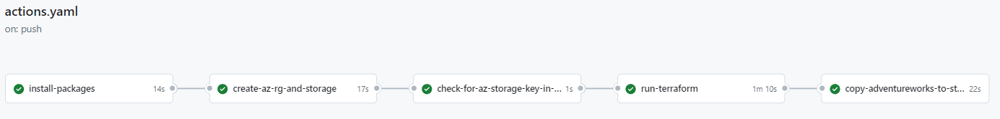

## Azure dbt Pipeline Summary

This simple pipeline loads CSV data that has been extracted from the AdventureWorks sample OLTP database into Azure SQL Database using Azure Data 
Factory (ADF), and then transformed with dbt.

### Pipeline features at a glance:

* Continuous integration / continuous deployment (CI/CD) - *GitHub Actions*
* Infrastructure-as-Code (IaC) of Azure microservices - *GitHub Actions with Azure CLI and Terraform (Azure remote backend)*
* Azure key security - *GitHub Secrets*
* Data transformation - *dbt*


## Table of Contents

[Project Objective](#Project-Objective)<br />
[Pipeline Objective](#Pipeline-Objective)<br />
[Future Improvements](#Future-Improvements)<br />
[Data Sources](#Data-Sources)<br />
[Pipeline Features](#Pipeline-Features)<br />
[Selection of Azure Microservices](#Selection-of-Azure-Microservices)<br />
[Data Modelling](#Data-Modelling)<br />
[Changelog](#Changelog)<br />
[License](#License)<br />


## Project Objective

The primary objective of this project was to learn the basics of Terraform, data pipelines in Azure and data modelling with dbt. For a more 
comprehensive data engineering project, see [https://github.com/JamesLauer/iss-weather-pipeline](https://github.com/JamesLauer/iss-weather-pipeline).

## Future Improvements

* Ensure Azure resource naming conventions follow best practices
* Complete data modelling for the "gold" SQL database layer
* Explore dbt testing in-depth

## Pipeline Objective

To automate the ingestion of raw CSV data from Azure blob storage into Azure SQL Database. This pipeline has been designed so that:

* CSV data is automatically loaded into an Azure SQL database table with Data Factory (DF-0_1). Each pipeline in DF-0_1 is configured with a 
  trigger to run when a CSV file with a particular file/path name ending lands in the storage container. 
* dbt is run locally for data testing and transformations. As such, this pipeline requires manual intervention to deliver data to downstream consumers.

## Data Sources

### Input Data

The AdventureWorks sample OLTP database was downloaded from the Microsoft [website](https://learn.microsoft.com/en-us/sql/samples/adventureworks-install-configure?view=sql-server-ver16&tabs=ssms) 
and certain tables were then extracted as CSV files using SSMS for the raw initial database data. The reasons for using the OLTP database (as 
opposed to the data warehouse database) and manually extracting certain tables as CSV files were as follows:

* The OLTP database has more opportunities for data modelling, whilst the data warehouse database is already modelled.
* ADF is a commonly used tool to ingest (copy) data from one resource to another. Additionally, the CSV file format is a very common source of data. 
  _Note that the AdventureWorks sample schema can also be specified when creating an Azure SQL database instance and ADF can then be used to ingest 
  data into a new Azure SQL database instance._ 

## Pipeline Features

### CI/CD

Continuous integration / continuous deployment forms an integral part of this pipeline in that it allows for a full deployment of the pipeline 
(using Terraform) instead of manually creating, updating or deleting Azure microservices in the Azure console. This includes the installation of 
Azure CLI and Terraform on the GitHub Actions Ubuntu-based runner, and then the creation of an Azure resource group, storage account and storage 
container using the Azure CLI within the GitHub Actions workflow for the Azure Terraform backend. 

Whilst Terraform can be used to provision the Azure resource group, storage account and storage container, it was decided to use a Azure Terraform 
backend, which required that the aforementioned resources already be created before running Terraform. The reason why a local or remote Git 
repository was not selected for the location of state file were as follows:
1. A local repository is not ideal for projects requiring collaboration due to lack of version control and team members having different state 
   file versions. Additionally, the state file may be accessed by unauthorised users resulting in security issues and the potential for the state 
   file to be modified or deleted.
2. The project's GitHub repository is public and state files should never be public due to security concerns. E.g. the state file may contain 
   resource IDs, secrets, access keys and other sensitive information.

Note that Terraform Cloud can be used as a remote repository as well, however, given this is an Azure project, an Azure storage container was used 
instead.

The GitHub Actions workflow template is located at .github/workflows/actions.yaml.



### IaC

The Terraform template file (i.e. tf/main.tf) and the Terraform template modules (i.e. tf/datafactory/datafactory/datafactory.tf, 
tf/datafactory/pipeline/pipeline.tf, and tf/mssqldb/mssqldb.tf) contain all the information necessary to create and modify the Azure microservices.
Modules were selected as a way of keeping the Terraform project more extensible. As discussed in the CI/CD section of this readme file, an Azure 
backend was also implemented.

A single Data Factory with linked services to both blob storage and SQL database was created and then the Terraform "for_each" meta-argument was used to 
create the pipelines. The for_each value was a set of strings as shown below. Each string was looped through to create the pipeline and to also 
define many of the properties of each pipeline e.g. the path of the json configuration files (which contains the activities json configuration and 
the SQL database schema), the source (CSV) and sink (SQL SB) dataset names and the blob event trigger (i.e. pipeline will run when a CSV file ending 
with a specific string value is landed in blob storage).

Note that nvarchar was specified for each column type due to ADF's inability to create the raw SQL database tables with the correct data types when 
using Terraform to provision the pipelines. As a workaround, each column had to be cast to the correct data type with dbt during the Bronze -> Silver 
transformation. dbt was also used to specify primary (PK) and foreign (FK) keys, as there didn't appear to be a way of doing this in ADF. As 
such, using dbt to specify the column types was not an inefficient solution in the end as dbt gave more control over the SQL database tables 
compared to ADF.

The json configuration files are located in the GitHub repository within tf/datafactory/pipeline/json/.

```
variable "dataset_name" {
  default = [
    "raw_person_address",
    "raw_person_businessentity",
    "raw_person_businessentityaddress",
    "raw_person_person",
    "raw_production_product",
    "raw_purchasing_purchaseorderdetail",
    "raw_sales_salesorderdetail",
    "raw_sales_salesorderheader",
    "raw_sales_salesperson"
  ]
  type = set(string)
}
```

Azure CLI was used to create the Azure resource group, storage account and storage container instead of Terraform, for the reasons explained in 
the CI/CD section. As such, these resources do not benefit from Terraform's inbuilt features. Note that the "import" command can be used to add 
pre-existing resources to the state file, however, this has not been implemented at this time.

### Security

Security features implemented into the pipeline included IAM roles, key security using GitHub Secrets for Azure keys and encryption for blob 
storage. Note that due to the personal project nature and overall scope of the project, security is basic and there are many improvements that 
could be made.

**IAM Roles** - An IAM role was required at both a user level (see more information [here](https://learn.microsoft.com/en-us/azure/role-based-access-control/role-assignments-portal)) and app level (see more information [here](https://learn.microsoft.com/en-us/azure/active-directory/develop/howto-add-app-roles-in-apps)) to access the blob storage containers 
storage account. 

**Key and Connection String Security** 

Key and connection string security is provided completely by GitHub Secrets. The following secrets are required for this project:

* _AZURE_CREDENTIALS_ - Used to log into Azure via the Azure CLI with a service principle in GitHub Actions. The Azure credentials consists of 
  "clientId", "clientSecret", "subscriptionId" and "tenantId". See [link](https://learn.microsoft.com/en-us/azure/developer/github/connect-from-azure?tabs=azure-portal%2Cwindows) for more information. 

* _AZURE_CLIENT_ID_ - Taken from AZURE_CREDENTIALS above and used for Terraform init and apply.  

* _AZURE_CLIENT_SECRET_ - Taken from AZURE_CREDENTIALS above and used for Terraform init and apply. 

* _AZURE_SUBSCRIPTION_ID_ - Taken from AZURE_CREDENTIALS above and used for Terraform init and apply. 

* _AZURE_TENANT_ID_ - Taken from AZURE_CREDENTIALS above and used for Terraform init and apply. 

* _AZURE_SQLSERVER_PASSWORD_ - Used to define the password for SQL Server 

* _AZURE_STORAGE_KEY_ - Used to copy initial AdventureWorks CSV files from the GitHub repository to Azure storage container (GH-0_4)

* _AZURE_STORAGE_CONNECTION_STRING_ - Used by Terraform and ADF to establish a linked service to the storage container that contains the CSV files.

* _AZURE_SQLDB_CONNECTION_STRING_ - Used by Terraform and ADF to establish a linked service to the SQL Database that is to contain the CSV file 
  raw data.

**Encryption**

Azure automatically encrypts blobs and files in the storage containers, and the data in the SQL database.


### Testing

Testing occurs entirely within dbt with its standard in-built generic tests (e.g. not_null and unique). More comprehensive testing besides that of 
not_null and unique is planned to be completed at a later time.

### Idempotency 

**Terraform** -
Terraform is inherently idempotent in that it only changes resources that have been modified in the Terraform template no matter how many times it is 
run.

**ADF** -
Currently, the ADF pipelines are not set up to be idempotent (i.e. if they are manually run repeatedly, there will be duplication of data in the 
raw SQL database tables). Due to having no fresh data to incrementally load into the tables, this is not a concern at the moment. However, if fresh data 
were to be incrementally loaded then this problem would need to be resolved. The most simple solution to this problem would be:
* Once the CSV file data has been loaded to the raw SQL database tables, move the file to another directory (by changing the file path) in blob storage. 
  Note that this isn't a foolproof method in that the same CSV could be uploaded again by accident resulting in duplication of data. If set up 
  correctly, dbt should pick up on the duplication of data when running the in-built "unique" test before dbt incrementally loads data into the 
  "silver" layer. However, this still does not solve the problem of having duplicated data in the "bronze" layer. 

## Selection of Azure Microservices

### Azure Storage
As this was an Azure project, Storage was selected due to being Azure's native data storage solution.

### Data Factory (ADF)
Whilst ADF is marketed as a low-code ETL/ELT and workflow orchestration tool, ADF pipelines are also expressed as JSON code. For deployment of 
the project's Data Factory and pipelines, the JSON code for each pipeline was saved to tf/datafactory/pipeline/json and then imported by the 
Terraform Azure provider to provision and manage the pipelines.

### SQL Database

Was selected as a data warehouse due to the small size of the data being stored and because the queries are not expected to be complex, therefore, 
should only require a single instance. 

## Data Modelling

Details to be added once data modelling complete.

[//]: # ()
[//]: # (Data modelling was completed using the Kimball dimensional modelling methodology to create dimension and fact tables. The following approach, as )

[//]: # (mentioned on pg. 38 of The Data Warehouse Toolkit 3rd Edition, was used:)

[//]: # (1. Select the business process.)

[//]: # (2. Declare the grain.)

[//]: # (3. Identify the dimensions.)

[//]: # (4. Identify the facts.)

[//]: # ()
[//]: # (### 1. Select the business process)

[//]: # ()
[//]: # (An obvious business process to select from the AdventureWorks OLTP database was the taking of an order. At a high level, this process is )

[//]: # (already written to the Sales.SalesOrderHeader table with other data gathered from tables through foreign keys.)

[//]: # ()
[//]: # (### 2. Declare the grain)

[//]: # ()
[//]: # (The Sales.SalesOrderHeader consists of one row per order, whereby the PK of this table is the SalesOrderID.  is the foreign key that is taken from )

[//]: # (Sales. SalesOrderDetail, which )

[//]: # (consists of 1 or more products that were ordered with each product having a unique ProductID. )


## Changelog
Details to be added

## License
Details to be added