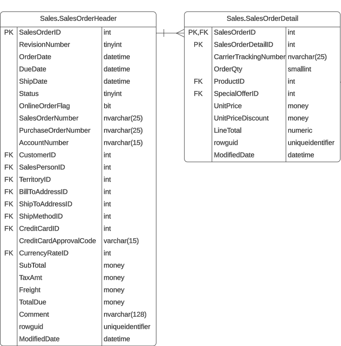
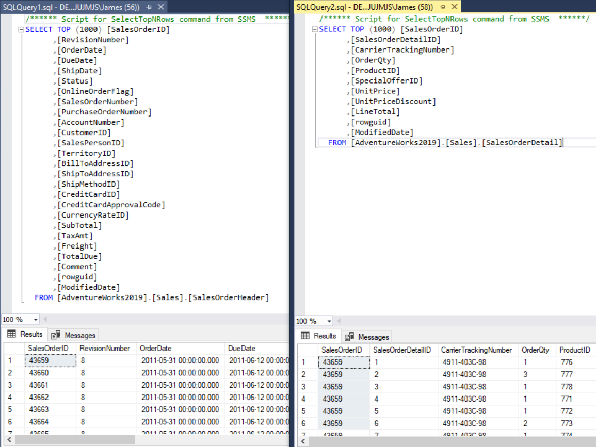
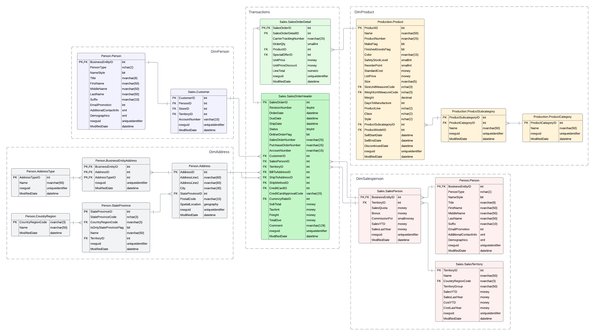
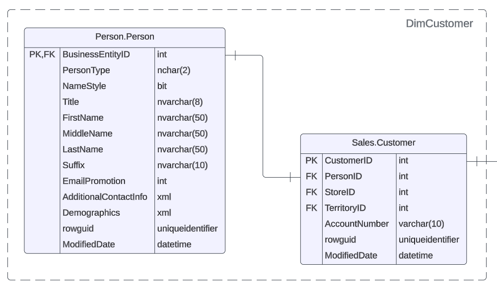

## Azure dbt Pipeline Summary

This simple pipeline loads CSV data that has been extracted from the AdventureWorks sample OLTP database into Azure SQL Database using Azure Data
Factory (ADF), and then transformed with dbt.

### Pipeline features at a glance:

* Continuous integration / continuous deployment (CI/CD) - *GitHub Actions*
* Infrastructure-as-Code (IaC) of Azure microservices - *GitHub Actions with Azure CLI and Terraform (Azure remote backend)*
* Azure key security - *GitHub Secrets*
* Data transformation - *dbt*


## Table of Contents

[Project Objective](#Project-Objective)<br />
[Pipeline Objective](#Pipeline-Objective)<br />
[Future Improvements](#Future-Improvements)<br />
[Data Sources](#Data-Sources)<br />
[Pipeline Features](#Pipeline-Features)<br />
[Selection of Azure Microservices](#Selection-of-Azure-Microservices)<br />
[Data Modelling](#Data-Modelling)<br />
[Changelog](#Changelog)<br />
[License](#License)<br />

## Project Objective

The primary objective of this project was to learn the basics of Terraform, data pipelines in Azure and data modelling with dbt. For a more
comprehensive data engineering project, see [https://github.com/JamesLauer/iss-weather-pipeline](https://github.com/JamesLauer/iss-weather-pipeline).

## Future Improvements

* Ensure Azure resource naming conventions follow best practices
* Complete data modelling for the "gold" SQL database layer
* Explore dbt testing in-depth

## Pipeline Objective

To automate the ingestion of raw CSV data from Azure blob storage into Azure SQL Database. This pipeline has been designed so that:

* CSV data is automatically loaded into an Azure SQL database table with Data Factory (DF-0_1). Each pipeline in DF-0_1 is configured with a
  trigger to run when a CSV file with a particular file/path name ending lands in the storage container.
* dbt is run locally for data testing and transformations. As such, this pipeline requires manual intervention to deliver data to downstream
  consumers.

## Data Sources

### Input Data

The AdventureWorks sample OLTP database was downloaded from the
Microsoft [website](https://learn.microsoft.com/en-us/sql/samples/adventureworks-install-configure?view=sql-server-ver16&tabs=ssms)
and certain tables were then extracted as CSV files using SSMS for the raw initial database data. The reasons for using the OLTP database (as
opposed to the data warehouse database) and manually extracting certain tables as CSV files were as follows:

* The OLTP database has more opportunities for data modelling, whilst the data warehouse database is already modelled.
* ADF is a commonly used tool to ingest (copy) data from one resource to another. Additionally, the CSV file format is a very common source of data.
  _Note that the AdventureWorks sample schema can also be specified when creating an Azure SQL database instance and ADF can then be used to ingest
  data into a new Azure SQL database instance._

## Pipeline Features

### CI/CD

Continuous integration / continuous deployment forms an integral part of this pipeline in that it allows for a full deployment of the pipeline
(using Terraform) instead of manually creating, updating or deleting Azure microservices in the Azure console. This includes the installation of
Azure CLI and Terraform on the GitHub Actions Ubuntu-based runner, and then the creation of an Azure resource group, storage account and storage
container using the Azure CLI within the GitHub Actions workflow for the Azure Terraform backend.

Whilst Terraform can be used to provision the Azure resource group, storage account and storage container, it was decided to use a Azure Terraform
backend, which required that the aforementioned resources already be created before running Terraform. The reason why a local or remote Git
repository was not selected for the location of state file were as follows:

1. A local repository is not ideal for projects requiring collaboration due to lack of version control and team members having different state
   file versions. Additionally, the state file may be accessed by unauthorised users resulting in security issues and the potential for the state
   file to be modified or deleted.
2. The project's GitHub repository is public and state files should never be public due to security concerns. E.g. the state file may contain
   resource IDs, secrets, access keys and other sensitive information.

Note that Terraform Cloud can be used as a remote repository as well, however, given this is an Azure project, an Azure storage container was used
instead.

The GitHub Actions workflow template is located at .github/workflows/actions.yaml.


### IaC

The Terraform template file (i.e. tf/main.tf) and the Terraform template modules (i.e. tf/datafactory/datafactory/datafactory.tf,
tf/datafactory/pipeline/pipeline.tf, and tf/mssqldb/mssqldb.tf) contain all the information necessary to create and modify the Azure microservices.
Modules were selected as a way of keeping the Terraform project more extensible. As discussed in the CI/CD section of this readme file, an Azure
backend was also implemented.

A single Data Factory with linked services to both blob storage and SQL database was created and then the Terraform "for_each" meta-argument was used
to
create the pipelines. The for_each value was a set of strings as shown below. Each string was looped through to create the pipeline and to also
define many of the properties of each pipeline e.g. the path of the json configuration files (which contains the activities json configuration and
the SQL database schema), the source (CSV) and sink (SQL SB) dataset names and the blob event trigger (i.e. pipeline will run when a CSV file ending
with a specific string value is landed in blob storage).

Note that nvarchar was specified for each column type due to ADF's inability to create the raw SQL database tables with the correct data types when
using Terraform to provision the pipelines. As a workaround, each column had to be cast to the correct data type with dbt during the Bronze -> Silver
transformation. dbt was also used to specify primary (PK) and foreign (FK) keys, as there didn't appear to be a way of doing this in ADF. As
such, using dbt to specify the column types was not an inefficient solution in the end as dbt gave more control over the SQL database tables
compared to ADF.

The json configuration files are located in the GitHub repository within tf/datafactory/pipeline/json/.

```
variable "dataset_name" {
  default = [
    "raw_person_address",
    "raw_person_businessentityaddress",
    "raw_person_person",
    "raw_production_product",
    "raw_purchasing_purchaseorderdetail",
    "raw_sales_salesorderdetail",
    "raw_sales_salesorderheader",
    "raw_sales_salesperson"
  ]
  type = set(string)
}
```

Azure CLI was used to create the Azure resource group, storage account and storage container instead of Terraform, for the reasons explained in
the CI/CD section. As such, these resources do not benefit from Terraform's inbuilt features. Note that the "import" command can be used to add
pre-existing resources to the state file, however, this has not been implemented at this time.

### Security

Security features implemented into the pipeline included IAM roles, key security using GitHub Secrets for Azure keys and encryption for blob
storage. Note that due to the personal project nature and overall scope of the project, security is basic and there are many improvements that
could be made.

**IAM Roles** - An IAM role was required at both a user level (see more
information [here](https://learn.microsoft.com/en-us/azure/role-based-access-control/role-assignments-portal)) and app level (see more
information [here](https://learn.microsoft.com/en-us/azure/active-directory/develop/howto-add-app-roles-in-apps)) to access the blob storage
containers
storage account.

**Key and Connection String Security**

Key and connection string security is provided completely by GitHub Secrets. The following secrets are required for this project:

* _AZURE_CREDENTIALS_ - Used to log into Azure via the Azure CLI with a service principle in GitHub Actions. The Azure credentials consists of
  "clientId", "clientSecret", "subscriptionId" and "tenantId".
  See [link](https://learn.microsoft.com/en-us/azure/developer/github/connect-from-azure?tabs=azure-portal%2Cwindows) for more information.

* _AZURE_CLIENT_ID_ - Taken from AZURE_CREDENTIALS above and used for Terraform init and apply.

* _AZURE_CLIENT_SECRET_ - Taken from AZURE_CREDENTIALS above and used for Terraform init and apply.

* _AZURE_SUBSCRIPTION_ID_ - Taken from AZURE_CREDENTIALS above and used for Terraform init and apply.

* _AZURE_TENANT_ID_ - Taken from AZURE_CREDENTIALS above and used for Terraform init and apply.

* _AZURE_SQLSERVER_PASSWORD_ - Used to define the password for SQL Server

* _AZURE_STORAGE_KEY_ - Used to copy initial AdventureWorks CSV files from the GitHub repository to Azure storage container (GH-0_4)

* _AZURE_STORAGE_CONNECTION_STRING_ - Used by Terraform and ADF to establish a linked service to the storage container that contains the CSV files.

* _AZURE_SQLDB_CONNECTION_STRING_ - Used by Terraform and ADF to establish a linked service to the SQL Database that is to contain the CSV file
  raw data.

**Encryption**

Azure automatically encrypts blobs and files in the storage containers, and the data in the SQL database.

### Testing

Testing occurs entirely within dbt with its standard in-built generic tests (e.g. not_null and unique). More comprehensive testing besides that of
not_null and unique is planned to be completed at a later time.

### Idempotency

**Terraform** -
Terraform is inherently idempotent in that it only changes resources that have been modified in the Terraform template no matter how many times it is
run.

**ADF** -
Currently, the ADF pipelines are not set up to be idempotent (i.e. if they are manually run repeatedly, there will be duplication of data in the
raw SQL database tables). Due to having no fresh data to incrementally load into the tables, this is not a concern at the moment. However, if fresh
data were to be incrementally loaded then this problem would need to be resolved. The most simple solution to this problem would be:

* Once the CSV file data has been loaded to the raw SQL database tables, move the file to another directory (by changing the file path) in blob
  storage.
  Note that this isn't a foolproof method in that the same CSV could be uploaded again by accident resulting in duplication of data. If set up
  correctly, dbt should pick up on the duplication of data when running the in-built "unique" test before dbt incrementally loads data into the
  "silver" layer. However, this still does not solve the problem of having duplicated data in the "bronze" layer.

## Selection of Azure Microservices

### Azure Storage

As this was an Azure project, Storage was selected due to being Azure's native data storage solution.

### Data Factory (ADF)

Whilst ADF is marketed as a low-code ETL/ELT and workflow orchestration tool, ADF pipelines are also expressed as JSON code. For deployment of
the project's Data Factory and pipelines, the JSON code for each pipeline was saved to tf/datafactory/pipeline/json and then imported by the
Terraform Azure provider to provision and manage the pipelines.

### SQL Database

Was selected as a data warehouse due to the small size of the data being stored and because the queries are not expected to be complex, therefore,
should only require a single instance.

## Understanding the Data: AdventureWorks OLTP Database

Before we go into how the data from the AdventureWorks OLTB database was modelled, let's understand the current state of the data and what it
represents.

### The Adventure Works Company

The AdventureWorks database is a sample database that contains data from a fictional company called Adventure Works. According
to [Microsoft](https://learn.microsoft.com/en-us/analysis-services/multidimensional-tutorial/analysis-services-tutorial-scenario?view=asallproducts-allversions):

```
"...Adventure Works Cycles is a large, multinational manufacturing company that produces and distributes metal and composite bicycles to commercial
markets in North America, Europe, and Asia. The headquarters for Adventure Works Cycles is Bothell, Washington, where the company employs 500 workers.
Additionally, Adventure Works Cycles employs several regional sales teams throughout its market base.

"In recent years, Adventure Works Cycles bought a small manufacturing plant, Importadores Neptuno, which is located in Mexico. Importadores Neptuno
manufactures several critical subcomponents for the Adventure Works Cycles product line. These subcomponents are shipped to the Bothell location for
final product assembly. In 2005, Importadores Neptuno became the sole manufacturer and distributor of the touring bicycle product group.

"Following a successful fiscal year, Adventure Works Cycles now wants to broaden its market share by targeting advertising to its best customers,
extending product availability through an external Web site, and reducing the cost of sales by reducing production costs."
```

### The Data

From investigation of the tables and the ERD, it appears that the database adheres to Third-Normal-Form (3NF).

STATE WHY

## Data Modelling

Data modelling was completed using the Kimball dimensional modelling methodology to create dimension and fact tables. The following approach, as
mentioned on pg. 38 of The Data Warehouse Toolkit 3rd Edition, was used:

1. Select the business process.
2. Declare the grain.
3. Identify the dimensions.
4. Identify the facts.

### 1. Select the business process

An obvious business process to select from the AdventureWorks OLTP database was the sales transactions. At an OLTP database level, the
transactions are written to the Sales.SalesOrderHeader and Sales.SalesOrderDetail tables.

One question that arises is: can sales transactions be expressed as a single fact table or are multiple fact tables required?

Analysing the Sales.SalesOrderHeader table, we can see that there are multiple sub-processes as reflected by the OrderDate and ShipDate columns,
both of which occur at different times. Typically, with processes occurring at different times, multiple fact tables (one for each process) are
recommended so that null values don't complicate the querying. E.g. if the order hasn't shipped yet then there'll be a null value in ShipDate. 
However, in the Sales.SalesOrderHeader table this isn't actually an issue because there are no null values in the ShipDate column, which is 
backed up by the ModifiedDate always equaling the ShipDate. Therefore, the data can be thought of as representing a single process i.e. the 
completed transaction process.

### 2. Declare the grain

The Sales.SalesOrderHeader consists of one row per order, whereby the primary key (PK) of this table is the SalesOrderID. The SalesOrderID is also a
foreign key (FK) in the Sales.SalesOrderDetail in a 1-to-many relationship (i.e. the SalesOrderID is unique in the Sales.
SalesOrderHeader table but is used many times in the Sales.SalesOrderDetail table due to a sales order having one or more product purchases
in each transaction).
See the ERD and SSMS screenshots below for a visual explanation.





From the perspective of the fact table, the grain selected is the SalesOrderDetailID (PK) from the Sales.SalesOrderDetail table as this is each
product sold per order. This can be considered the "atomic grain" as it is the lowest level of detail (i.e. what each row represents) captured for
the sales transaction (i.e. the business process selected).

### 3. Identify the dimensions

Thinking about the required dimensions from the question of "who, what, where, when, why and how" associated with each sales transaction, it can
be inferred that the following dimensions are important:

* Who - customer dimension, salesperson dimension
* What - product dimension
* Where - address dimension
* Why - NA
* When - date dimension
* How - method of payment dimension



#### Customer dimension

The customer dimension was created by implementing an inner join on Sales.Customer.PersonID = Person.Person.BusinessEntityID. This resulted in only 
those people who are considered customers (e.g. as opposed to those that are sales people) ending up in the dimension. 

See ERD below showing the join. Note that the rowguid and ModifiedDate columns from each table were not included in the final dimension.



#### Salesperson dimension

#### Surrogate keys

Surrogate keys have been added to each dimension table by using the following 

### 4. Identify the facts

Which customer has spent the most money and how much have they spent?

### Creating the date dimension

Whilst the dbt_date package can be used to create a date dimension with dbt, given that Azure SQL database was used for this project, that option
wasn't available at the time of writing. This was due to errors when using tsql_utils (which allows for dbt_utils and dbt_date to be used with Azure
databases) to try to create the date dimension. The other solution was to use Aaron Bertrand's excellent
script located here (https://www.mssqltips.com/sqlservertip/4054/creating-a-date-dimension-or-calendar-table-in-sql-server/) to create the date
dimension instead.

### Address Dimension

The address dimension only has business entities that have addresses i.e. there are no nulls

## General Notes

1. ADF: When automatically creating tables from CSV files, the carriage return escape character (\r) located after the last column (typically
   ModifiedDate) in the UTF-8 CRLF formatted CSV files was causing issues. To get it to work properly, as well as be able to convert the
   ModifiedDate column to datetime format, the CSV files had to be converted to UTF-8 LF formatted CSV files.

## Changelog

Details to be added

## License

Details to be added